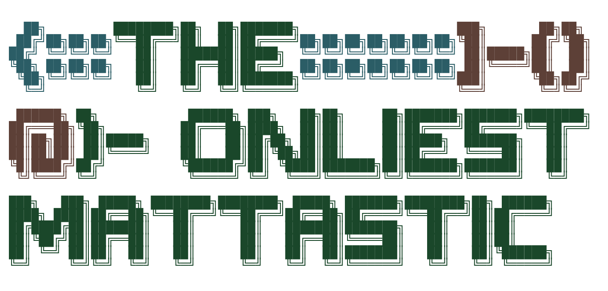

# 🧑‍🚀 Oh, Hello! — I'm Matthew | @TheOnliestMattastic  

<picture>
  <source media="(prefers-color-scheme: dark)" srcset="./images/logo-dark.png">
  <source media="(prefers-color-scheme: light)" srcset="./images/logo-light.png">
  
</picture>

  

## 🚀 Featured Projects  

- **🐱 powerCat (PowerShell, Pester, GitHub Actions)** — Published a professional‑grade PowerShell module with automated testing and CI/CD, streamlining code/documentation bundling for recruiters and collaborators.  
- **🧰 Bash Toolkit (Bash, rclone, cron)** — Built and documented a suite of portable scripts to automate repetitive system tasks, reducing manual overhead and improving reliability.  
- **📊 Tobacco & Vital Signs Research (R, ggplot2, R Markdown)** — Conducted statistical modeling and data visualization on smoking’s impact on blood pressure/heart rate, producing a reproducible, published report.  
- **🪐 The Onliest Folio (HTML, CSS, JavaScript)** — Developed a dual‑purpose personal portfolio that doubles as a beginner‑friendly template. Added clear inline comments and structured guidance so non‑coders can fork, customize, and publish their own sites, lowering barriers to entry for newcomers to GitHub and web development.  
- **⚔️ Battle Tactics Arena: Refactored & Remastered (Lua, LÖVE2D)** — 2D turn-based tactical RPG rebuilt with modular architecture, animated sprites, and data-driven design. Demonstrates clean code practices, state management, and portfolio-quality game development.  

## ✨ Skills Snapshot  

**Core Spikes (Depth):**  

- **Automation & Scripting:** PowerShell (module publishing, Pester testing, CI/CD pipelines), Bash (automation workflows)  
- **DevOps & Workflow:** GitHub Actions, version control (Git/GitHub), reproducible reporting  

**Supporting Skills (Breadth):**  

- **Web & Documentation:** HTML/CSS, Markdown (repo branding, technical docs, reproducible reports)  
- **Game Development & Creative Tools:** C++ (Unreal Engine 5), Lua (LÖVE2D), Blender, Krita  
- **IT Support & Systems:** Windows 10/11, Linux (Nobara/Fedora, Pop!_OS), macOS; POS/device setup; end‑user training  

## 🧬 About Me  

I’m a **versatile technologist** who thrives at the intersection of **IT support, automation, and creative development**. Think of me as a **generalist with spikes**:  

- **Breadth:** I’ve worn many hats—supporting end‑users, troubleshooting POS systems, writing documentation, and building indie games.  
- **Depth:** My strongest spike is in **automation and scripting**—publishing PowerShell modules, building CI/CD pipelines, and writing ergonomic tools that save time and reduce friction.  

I’m **CompTIA A+ certified**, a lifelong tinkerer, and a believer in making tech accessible, memorable, and human‑friendly.  

## 🔭 Current Focus  

- Expanding automation coverage for support tasks and deployment workflows  
- Polishing repo branding and READMEs to highlight problem‑solving and impact  
- Refining BTAR-R: adding special abilities, AI opponents, and level progression  
- Maintaining a cohesive visual identity across repos (ASCII headers, badges, README cards)  

## 🤖 On AI Tooling  

I use AI assistants—primarily **Claude** and **Amp**—as productivity tools in my development workflow. For anyone who identifies as **neurodivergent** (ADHD, ASD, OCD, etc.), these tools can be genuinely transformative: they handle context-switching, provide real-time documentation, and reduce cognitive friction during implementation. I treat them as **collaborative partners**, not replacements—I review, test, and maintain full ownership of my code. Transparency about tool usage matters.

## 🌌 Values  

I believe in **clear education, fair wages, and reducing barriers to entry in tech**. My code is written to teach as much as it runs, and my documentation is designed to empower others. I'm also committed to **destigmatizing neurodivergence** and **making dev tooling more accessible**.  

## 👽 Contact  

Curious about my projects? Want to collaborate or hire for entry-level IT/support/dev roles? Shoot me an email or connect on GitHub—I reply quickly and love new challenges.  

  

> *“Sometimes the questions are complicated and the answers are simple.”* — Dr. Seuss  

