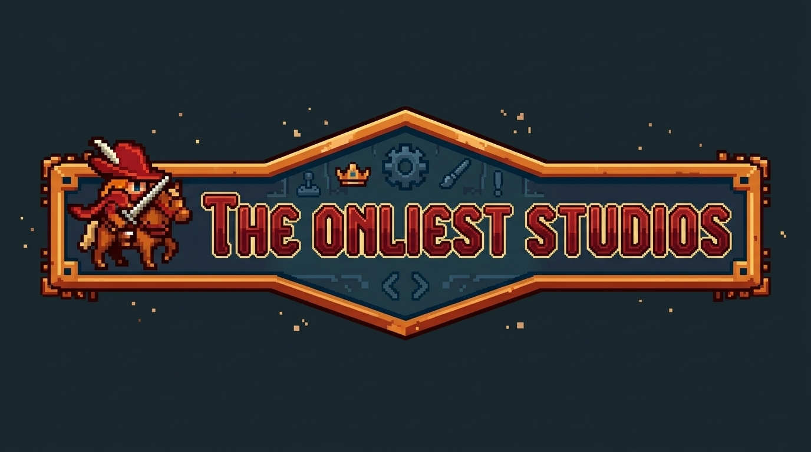

# 🧙 Matthew Poole Chicano | The Onliest Mattastic

I am a technical generalist with significant spikes in systems architecture and automation. My work is driven by a commitment to intentional engineering, making developer tooling more accessible, and reducing barriers to entry in tech.

## 🏯 The Onliest Studios

The Onliest Studios is my vehicle for software and game publishing, where I turn complex system requirements into accessible, functional reality.

## 💎 Key Projects

- **StatelessIO**: The flagship API suite for modern systems. Renamed and refactored for maximum modularity and stateless efficiency.
- **BTA (Battle Tactics Arena)**: A tactical, turn-based RPG framework built on the Love2D engine. Proof that Lua and ECS architecture can handle complex grid-based logic.
- **PowerCat**: A PowerShell CLI utility engineered to recursively scan directories and bundle codebases into LLM-optimized context files.
- **Hyperfix.nvim**: A Neovim configuration built for focus. Leveraging Lua to create a terminal environment that accommodates neurodivergent workflows without the bloat.

## 🪄 Technical Stack

- **Languages**: Lua (ECS, Neovim), PowerShell/Bash (Automation), JavaScript/Node.js, C++.
- **Frameworks & Engines**: Love2D, Unreal Engine 5.
- **Creative & Asset Tooling**: Blender, Material Maker.
- **Infrastructure**: CI/CD (GitHub Actions), Pester (Automated Testing), Systems Architecture.

## 📜 Professional Engagements

I am currently open to the following:

- **Professional Consulting**: Systems architecture audits and automation strategy.
- **Freelance Development**: Specialized CLI tools, API development, and game systems.
- **Talent Acquisition**: Open to discussions regarding engineering roles centered on infrastructure, systems, or tools development.

### 🔮 Contact/Connect

---

> _"Clarity over cleverality."_
